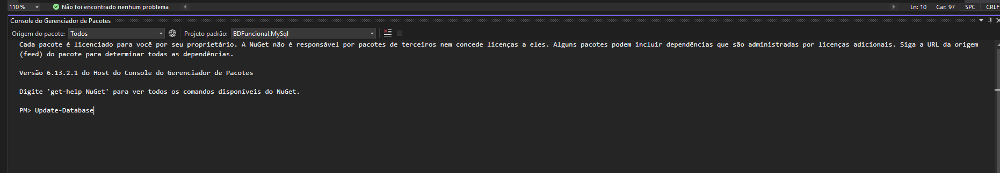
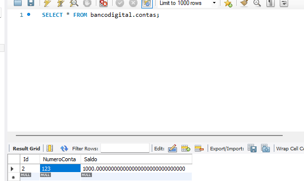
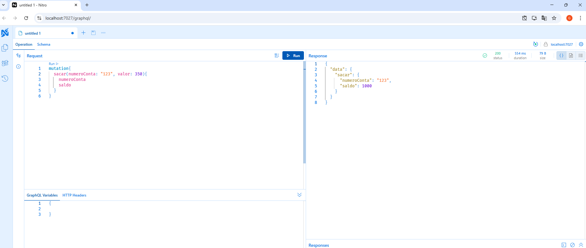
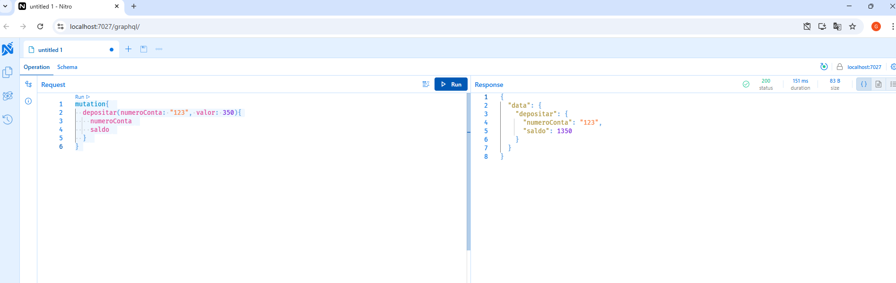
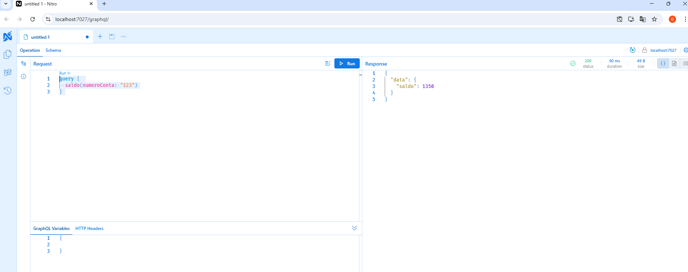

# BancoDigitalFuncional

🚀 Como rodar o projeto
✅ Pré-requisitos
Certifique-se de ter os seguintes itens instalados na sua máquina:

.NET SDK 9.0
Visual Studio
MySql

🔧 Configuração inicial
1. Clone o repositório:

git clone https://github.com/Gabriellabenevides/BancoDigitalFuncional

2. (Opcional) Configure o banco de dados
Verifique a connection string no arquivo appsettings.json do projeto principal e ajuste se necessário:

    "ConnectionStrings": {
        "BDFuncionalConnection": "server=localhost;database=bancodigital;user=root;password=root"
    }

3. Execute as migrações do Entity Framework
- Para isso você deve abrir o console de gerenciador de pacotes, selecionar o projeto como padrão o MySql e rodar o seguinte comando: Update-Database

4. Agora está pronta para rodar e testar!
- Foi configurado inicialmente uma conta no banco que é criada automaticamente ao rodar o projeto e podemos realizar testes com ela. 

Para Sacar:

mutation{
  sacar(numeroConta: "123", valor: 350){
    numeroConta
    saldo
  }
}

Para Depositar:

mutation{
  depositar(numeroConta: "123", valor: 350){
    numeroConta
    saldo
  }
}

Para Obter saldo:

query {
  saldo(numeroConta: "123")
}

🛠️ Tecnologias usadas
- ASP.NET Core
- GraphQL (HotChocolate)
- Entity Framework Core
- AutoFixture (para geração de dados aleatórios nos testes)
- Fine Code Coverage (para cobertura de testes)

